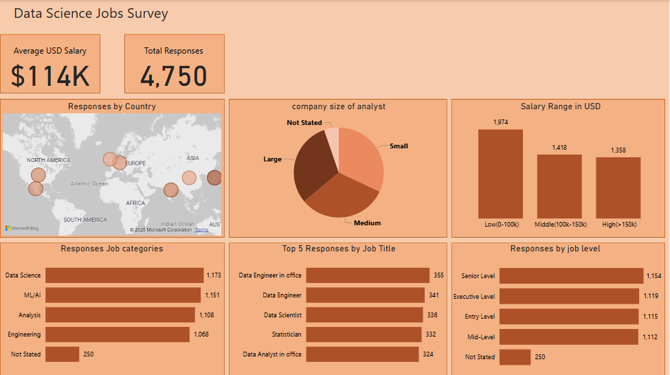
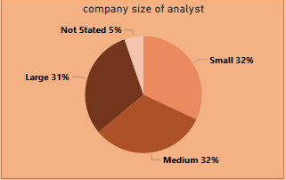
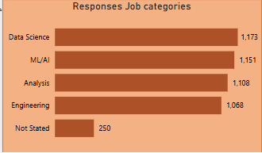
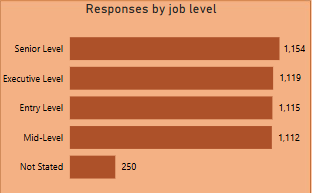

# Data-Analyst-survey-analysis

## INTRODUCTION
I am doing this analysis for experience gain and to improve my skills and also for writing an analysis presentation

## PROBLEM STATEMENT
This dataset contains job listings for data science positions, providing a comprehensive view of the data science job market. The dataset includes essential fields such as job title, company, location, salary range, and required skills, helping users analyze trends in data science employment.
i will be using the dataset i got to show the following
- size of the company most workers work for
- jobs that responders partake in
- level in their jobs
## DATA SOURCING
The data was made by kaggle collecting a survey of people who worked in Machine Learning & Data Science Survey from 2022. the link to the data set can be found [Here](https://www.kaggle.com/datasets/brsahan/data-science-job)
## SKILLS DEMONSTRATED
For this project i used 

1. Microsoft excel: To clean the data for visualization 
2. Power BI: To visulize the data
### Data Cleaning
The data when sourced contained a lot of short form in the experience level, employment type and company level. these where replaced by the expanded word form.
There was a salary column which was removed to use the more standard column which converted all the salary to USD equivalent.
blank spaces in job category and in company level was replaced by not stated

## ANALYSIS AND VISUALIZATION

> size of company that most people work for

from the analysis and visualization we can see that most responses say they work for medium and small scale companies, which is a bit suprising because i would think that the larger companies needed mor workers but that doesnt seem like it.

> Jobs that responders partake in

Here we can see that most people work in Data Science followed by machine learling and then Data analysis giving us a predictable view since the dataset was a survey on data jobs

> level in their jobs

Here we can see that most responders are from senior level workers, however there isnt a lot to seperate between the entry level and mid level so we can say that mthe responders really are available at every level in the corporate ladder 
## RECOMMENDATIONS AND CONCLUSION
